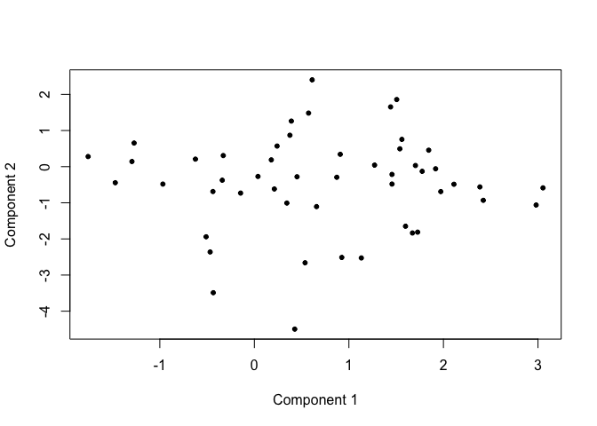

# supFTSVD_JM Vignette


# Introduction

This R package is built for implementing supFTSVD-JM proposed for joint
modeling of high-dimensional longitudinal and time-to-event data. For
methodological details, we recommend to read Alam and Luo (202x). Note
that the package is still in developing stage.

# Installation

- To install the package, run the following codes

``` r
devtools::install_github("https://github.com/msalam14/supFTSVD_JM")
```

- Call the package

``` r
library(supFTSVDJM)
```

    Loading required package: Matrix

    Loading required package: rsvd

    Loading required package: matrixcalc

    Loading required package: mvtnorm

    Loading required package: sn

    Loading required package: stats4


    Attaching package: 'sn'

    The following object is masked from 'package:matrixcalc':

        vech

    The following object is masked from 'package:stats':

        sd

    Loading required package: mgcv

    Loading required package: nlme

    This is mgcv 1.9-1. For overview type 'help("mgcv-package")'.

    Loading required package: refund

    Loading required package: fda

    Loading required package: splines

    Loading required package: fds

    Loading required package: rainbow

    Loading required package: MASS

    Loading required package: pcaPP

    Loading required package: RCurl

    Loading required package: deSolve


    Attaching package: 'fda'

    The following object is masked from 'package:graphics':

        matplot

    Loading required package: fdapace

    Loading required package: foreach

    Loading required package: doParallel

    Loading required package: iterators

    Loading required package: parallel

    Loading required package: doRNG

    Loading required package: rngtools

    Loading required package: survival

    Loading required package: supFTSVD

- For demonstration, we first generate survival times for $50$ subjects
  along with data for $100$ longitudinal features.

``` r
# Number of subjects
n<-50

# feature dimension
pdim<-c(100)
# No of rank-1 components
r<-3
model_rank<-r

# Weight for components
lmd_val<-c(5.20,4.80,3.35)

# noise variance in tensor
Tau2<-c(0.1)

# Parameters for supervised component
Eta2<-c(1,1,1)

#diag(Eta2)<-c(1.85,2.50,1.3,1.60,1.25,3.5)
gam_par<-matrix(c(2.2,1.6,2.5,3.6,-1.50,2.6),ncol=3)
gam_par<-apply(gam_par,2,function(u){u/sqrt(sum(u^2))})

# Grid of Time points
nres<-101
Time<-seq(0,1,length.out=nres)

# Singular Function
PhiFunc<-list(function(x){(8+(6*x^8)-(3*x^2)-(4*x^3))/sqrt(45.61)},
              function(x){(10*x^2/exp(x^5))/(sqrt(10-10*exp(-2)))},
              function(x){sqrt(2)*sin(2.5*pi*x)})

PhiF<-sapply(1:r,function(k){PhiFunc[[k]](Time)})

# Feature loading
set.seed(pdim)
Bval<<-sapply(1:r, function(b){runif(pdim)})
bval<<-Bval*outer(rep(1,pdim),1/apply(Bval,2,norm,type="2"))

# controlling the signal ot noise ratio
cmp_var<-((lmd_val^2)*Eta2)
CmpV<-Reduce(`+`,lapply(1:r,function(k){cmp_var[k]*(outer(bval[,k],
                                                          PhiF[,k]))^2}))


# Survival parameters
alp_par<-matrix(c(3.50,2.60,-0.15,-0.20,0.15),ncol=1)
lmd<-0.10
## Subject-specific covariates # ADAS13
set.seed(n)
Vmat<<-cbind(round(runif(n),2),round(rbeta(n,2.5,1.5),2))
EAval<-Vmat%*%gam_par
miv_subE<-sapply(Eta2,function(u){rnorm(n,mean=0,sd=sqrt(u))})
ZetaSL<-EAval+miv_subE

# Training data set
# Survival data generation
seed_n<-4
set.seed(seed_n*24) # for both survival and longitudinal data
surv_time<-(-log(runif(n,0,1)))/(lmd*exp(as.numeric(cbind(Vmat,
                                                          ZetaSL)%*%(alp_par))))
summary(surv_time)
```

        Min.  1st Qu.   Median     Mean  3rd Qu.     Max. 
    0.005964 0.091237 0.254392 0.671896 0.836566 5.446124 

``` r
censor_time<-runif(n,0,5)
survT<-apply(cbind(surv_time,censor_time),1,min)
#summary(survT)
cenI<-apply(cbind(surv_time,censor_time),1,which.min)-1
cen_indx<-which(survT>1)
survT[cen_indx]<-1
cenI[cen_indx]<-1

# training m-omics data
m_i<-sample(5:10,n,replace = TRUE)
bl_time<-sapply(survT, function(u){runif(1,0,u)})
tr_obsTIME<-lapply(1:n, function(i){c(0,sort(runif(m_i[i]-2,0,
                                                   survT[i])),survT[i])})
gen_dataCFS<-omics_data_gen_surv(m_i = m_i,Zeta= ZetaSL,obsTIME = tr_obsTIME,
                                 Xi = bval,PsiF = PhiFunc,sing_val = lmd_val,
                                 Data_Var = Tau2,surv_time=survT)
```

- Next we analyze the data using the supFTSVD-JM model

``` r
fit_model<-supFTSVD_JM(datlist = gen_dataCFS$data,
                       response=Vmat, interval = c(0,1), r = model_rank,
                       resolution=50, CVPhi=FALSE, K=5, cvT=5,
                       smooth=0.001,
                       surv_time=survT,
                       censor_status=cenI,
                       maxiter=25, epsilon=1e-5,KInd=NULL,rsvd_seed=100,
                       conv_criteria = "cond_lik",
                       survX = Vmat,scale = TRUE,constant_hazard = TRUE)

save(fit_model,file = "data/illustration_fit_model.RData")
```

``` r
load("data/fit_model.RData")
```

- Goodness of fit statistics

``` r
fit_model$r2_stat
```

        R2_Yhat    r_Yhat R2lm_Yhat      R2_Xb       r_Xb   R2lm_Xb
    1 0.5413866 0.5489769 0.6280238 0.09159516 0.09307576 0.2632628
    2 0.6599937 0.6621681 0.7242660 0.08770018 0.08825040 0.2634865
    3 0.7387908 0.7388101 0.7878740 0.08846034 0.08903815 0.2658044

- Predicted subjects’ loadings for first two components

``` r
plot(fit_model$A.hat[,1],fit_model$A.hat[,2],pch=20,xlab="Component 1",ylab="Component 2")
```


